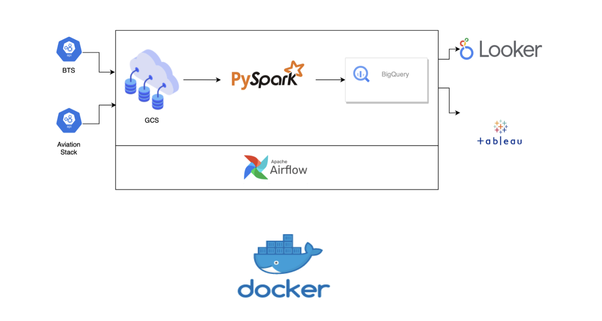
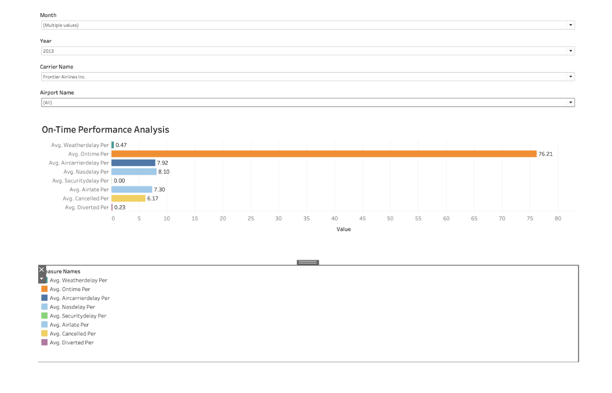
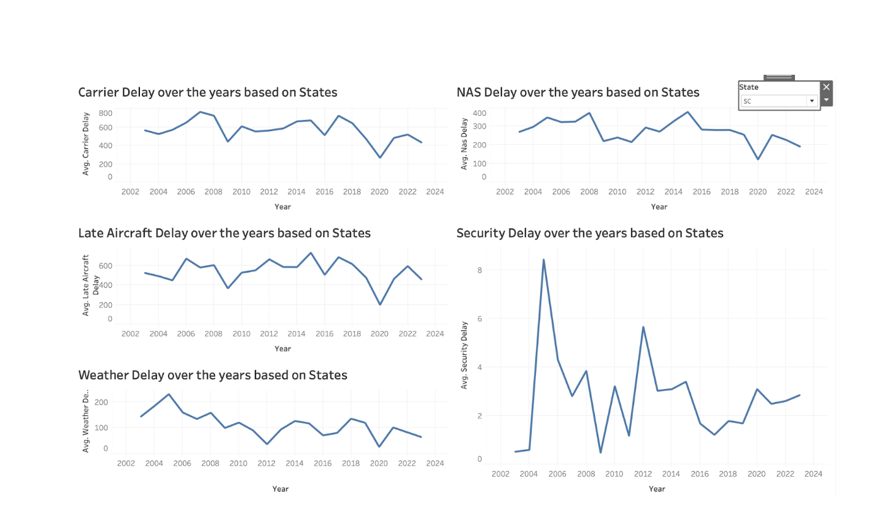
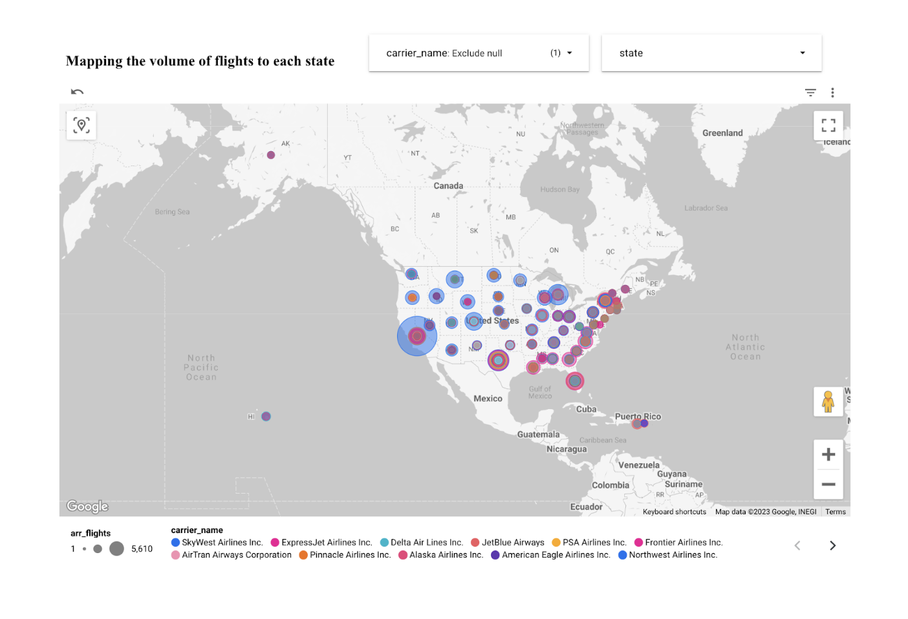
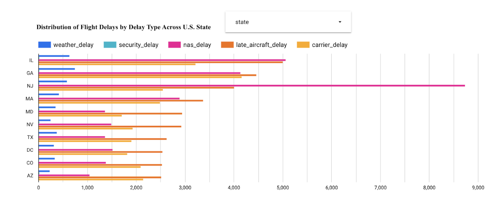
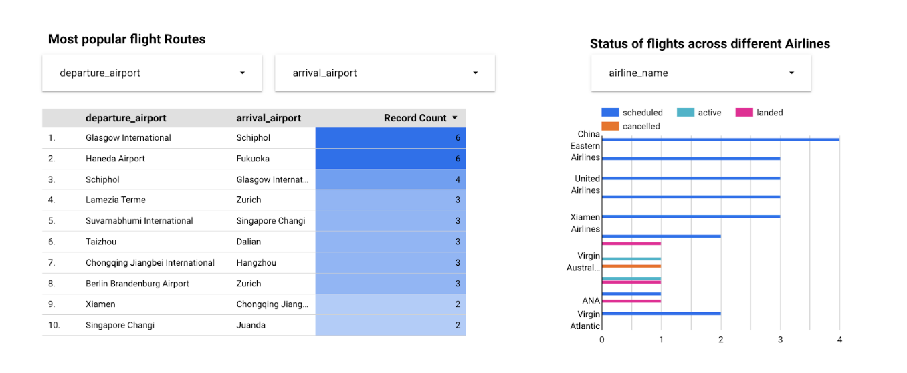
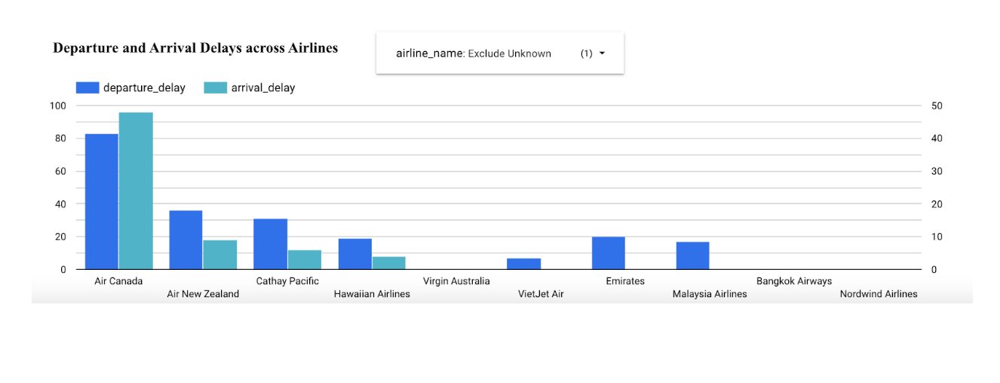

#
# **OptiFly**

**A data pipeline with PySpark, Airflow, GCP, BigQuery, Tableau, Looker and Docker!**

## **Description**

**Objective :**

The OptiFly project aims to leverage data center-scale computing technologies to provide travelers make optimal travel decisions considering factors like delays, departure and arrival locations, and months of travel. Efficiently analyze and visualize the intricate world of aviation data by creating a streamlined pipeline. Integrating Google Cloud Storage, Spark, BigQuery, Tableau, and Looker, the goal is to provide insights into flight patterns, delays, and airline performance.

**Dataset:**

1. [Bureau of Transportation and Statistics](https://www.bts.gov/topics/airlines-and-airports/quick-links-popular-air-carrier-statistics)

    U.S. domestic flight data spanning from 2003 to 2023, containing key metrics such as carrier information, airport details, flight counts, delays, and cancellations.

2. [Aviation Stack](https://aviationstack.com/documentation)

    Global Real-time global flight data obtained from the Aviation Stack API, containing key metrics such as flight dates, statuses, departure and arrival airport details, delays, scheduled times, airline names, and flight ICAO codes.

### **Tools & Technologies:**

- Cloud - [**Google Cloud Platform**](https://cloud.google.com/)
- Containerization - [**Docker**](https://www.docker.com/), [**Docker Compose**](https://docs.docker.com/compose/)
- Orchestration - [**Airflow**](https://airflow.apache.org/)
- Data Processing Tool - [**Dataproc**](https://cloud.google.com/dataproc?hl=en)
- Data Warehouse - [**BigQuery**](https://cloud.google.com/bigquery?hl=en)
- Data Lake - [**Google Cloud Storage**](https://cloud.google.com/storage?hl=en)
- Data Visualization - [**Looker**](https://cloud.google.com/looker?hl=en) **,** [**Tableau**](https://www.tableau.com)
- Language - [**Python**](https://www.python.org/), [**PySpark**](https://spark.apache.org/docs/latest/api/python/index.html)

### **Architecture:**

**Final Results:**

##

## **Setup:**

#### **WARNING: You will be charged for all the infra setup. You can avail 300$ in credit by creating a new account on GCP.**

**Prerequisites:**

1. **Installing Docker**:

    Docker 101 Tutorial:[Get Started with Docker](https://www.docker.com/101-tutorial)

    YouTube Tutorial:[Installing Docker](https://www.youtube.com/watch?v=8Ev1aXl7TGY)

1. **Setting Up a Google Cloud Storage (GCS) Account:** This involves creating a service account, setting up a storage bucket, and configuring Identity and Access Management (IAM) roles and permissions.
2. **Creating a Database in BigQuery**
3. **Setting Up a Connection in Airflow Between Airflow and GCP:** This is crucial for orchestrating and automating your data pipeline workflows.

### **Get Going!**

   A video walkthrough of how I run my project - Demo Video

### **Debug**

  If you run into issues, see if you find something in the debug. Make sure to refer to the dag logs and docker logs for any errors.

### **How can I make this better?!**

  A lot can still be done :).

- Use Kafka with streaming data
- Do some Machine Learning Modelling
- Write data quality tests
- Include CI/CD
- Add more visualizations

### **Special Mentions**

  I'd like to thank the entire team for making this project a success. Project duties were equally shared and each of us contributed equally at all levels. We built this from scratch and the Datacenter Scale Computing course helped us to achieve our goal. We initially built our project entirely using Lab3 as a backup plan and then learnt about PySpark Data proc and incorporated it in our project.
